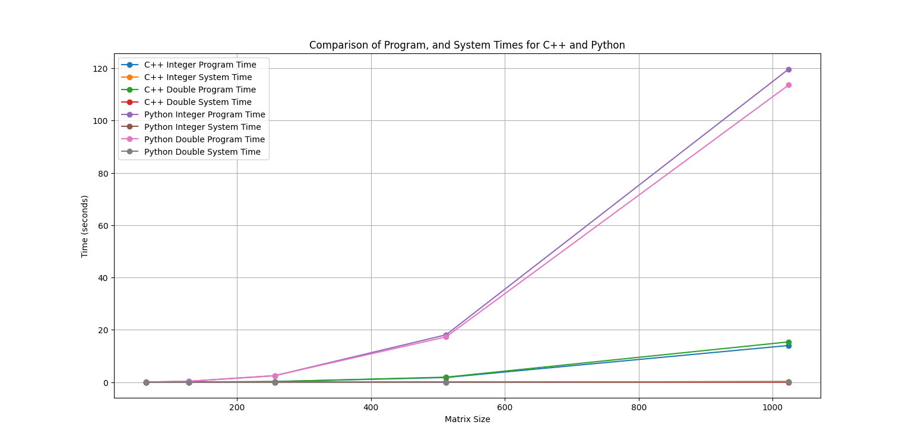

# **ES215: Assignment \- 1**

## **Implement programs to list the first 50 Fibonacci numbers.**

### **Using Recursion:**
```cpp
long long int fibonacci(int n) {
    if (n <= 1)
        return n;
    return fibonacci(n - 1) + fibonacci(n - 2);
}

void fibonacciRecursive(int n, bool ifPrint = false) {
    for (int i = 0; i < 50; i++) {
        if (ifPrint)
            cout << fibonacci(i) << " ";
        else
            fibonacci(i);
    }
    if (ifPrint) cout << endl;
}
```

### **Using Loop:**

```cpp
void fibonacciLoop(int n, bool ifPrint = false) {
    long long int prev2 = 0, prev1 = 1;
    if (n >= 1 && ifPrint) cout << prev2 << " ";
    if (n >= 2 && ifPrint) cout << prev1 << " ";

    for (int i = 2; i < n; i++) {
        long long int next = prev2 + prev1;
        if (ifPrint) cout << next << " ";
        prev2 = prev1;
        prev1 = next;
    }
    if (ifPrint) cout << endl;
}
```

### **Using Recursion and Memoization:**

```cpp
long long int fibonacci(int n, vector<long long int>& memo) {
    if (n <= 1)
        return n;

    if (memo[n] != -1)
        return memo[n];

    memo[n] = fibonacci(n - 1, memo) + fibonacci(n - 2, memo);
    return memo[n];
}

void fibonacciRecursiveMemoization(int n, bool ifPrint = false) {
    vector<long long int> memo(n, -1);
    for (int i = 0; i < 50; i++) {
        if (ifPrint)
            cout << fibonacci(i, memo) << " ";
        else
            fibonacci(i, memo);
    }
    if (ifPrint) cout << endl;
}
```

### **Using Loop and Memoization:**

```cpp
void fibonacciLoopMemoization(int n, bool ifPrint = false) {
    vector<long long int> memo(n);
    memo[0] = 0;
    if (n > 1)
        memo[1] = 1;

    for (int i = 2; i < n; i++) {
        memo[i] = memo[i - 1] + memo[i - 2];
    }

    if (ifPrint) {
        for (int i = 0; i < n; i++) {
            cout << memo[i] << " ";
        }
        cout << endl;
    }
}
```

### **Speedup Calculations of All Programs:**

```cpp
double measureExecutionTime(void (*fibonacciFunc)(int, bool), int n) {
    struct timespec start, end;
    clock_gettime(CLOCK_MONOTONIC, &start);
    fibonacciFunc(n, false);
    clock_gettime(CLOCK_MONOTONIC, &end);

    double time_taken = (end.tv_sec - start.tv_sec) * 1e9;
    time_taken = (time_taken + (end.tv_nsec - start.tv_nsec)) * 1e-9;
    return time_taken;
}

double computeAverageTime(void (*fibonacciFunc)(int, bool), int n, int iterations) {
    double total_time = 0.0;
    for (int i = 0; i < iterations; i++) {
        total_time += measureExecutionTime(fibonacciFunc, n);
    }
    return total_time / iterations;
}
```

To compute the speedup, we use the following formula:  
$$
Speedup = \frac{Time \; Taken \; by \; Compare \; Method}{Time \; Taken \; by \; Other \; Method}
$$

| Method | Compare-Time | Method-Time | Speedup |
| :---- | :---- | :---- | :---- |
| Recursion | 115.789s | 115.789s | 1 units |
| Loop | 115.789s | 1.2 x 10<sup>-7</sup>s | 9.649 x 10<sup>8</sup> units |
| Recursion with Memoization | 115.789s | 4.94 x 10<sup>-6</sup>s | 1.953 x 10<sup>7</sup> units |
| Loop with Memoization | 115.789s | 5.2 x 10<sup>-7</sup>s | 2.226 x 10<sup>8</sup> units |

## **Implement Matrix Multiplication**

### **Bucket 1: Using C++**

### **Integer Matrix Multiplication**

```cpp
void MatrixMultiplicationInt(int N) {
    vector<vector<int>> A(N, vector<int>(N, 1));
    vector<vector<int>> B(N, vector<int>(N, 1));
    vector<vector<int>> C(N, vector<int>(N, 0));
    
    struct timespec start, end;
    clock_gettime(CLOCK_MONOTONIC, &start);

    for(int i = 0; i < N; ++i) {
        for(int j = 0; j < N; ++j) {
            for(int k = 0; k < N; ++k) {
                C[i][j] += A[i][k] * B[k][j];
            }
        }
    }

    clock_gettime(CLOCK_MONOTONIC, &end);
    double time_taken = (end.tv_sec - start.tv_sec) + (end.tv_nsec - start.tv_nsec) / 1e9;
    cout << "Time taken by integer multiplication: " << time_taken << " seconds" << endl;
}
```

### **Double Matrix Multiplication**

```cpp
void MatrixMultiplicationDouble(int N) {
    vector<vector<double>> A(N, vector<double>(N, 1.0));
    vector<vector<double>> B(N, vector<double>(N, 1.0));
    vector<vector<double>> C(N, vector<double>(N, 0.0));
    
    struct timespec start, end;
    clock_gettime(CLOCK_MONOTONIC, &start);

    for(int i = 0; i < N; ++i) {
        for(int j = 0; j < N; ++j) {
            for(int k = 0; k < N; ++k) {
                C[i][j] += A[i][k] * B[k][j];
            }
        }
    }

    clock_gettime(CLOCK_MONOTONIC, &end);
    double time_taken = (end.tv_sec - start.tv_sec) + (end.tv_nsec - start.tv_nsec) / 1e9;
    cout << "Time taken by double multiplication: " << time_taken << " seconds" << endl;
}
```

### **Bucket 2: Using Python**

### **Integer Matrix Multiplication**

```python
def MatrixMultiplicationInt(N):
   A = [[1 for _ in range(N)] for _ in range(N)]
   B = [[1 for _ in range(N)] for _ in range(N)]
   C = [[0 for _ in range(N)] for _ in range(N)]

   start_time = time.time()

   for i in range(N):
       for j in range(N):
           for k in range(N):
               C[i][j] += A[i][k] * B[k][j]

   end_time = time.time()
   print(f"Time taken by integer multiplication: {end_time - start_time:.5f} seconds")
```

### **Double Matrix Multiplication**

```python
def MatrixMultiplicationDouble(N):
   A = [[1.0 for _ in range(N)] for _ in range(N)]
   B = [[1.0 for _ in range(N)] for _ in range(N)]
   C = [[0.0 for _ in range(N)] for _ in range(N)]

   start_time = time.time()

   for i in range(N):
       for j in range(N):
           for k in range(N):
               C[i][j] += A[i][k] * B[k][j]

   end_time = time.time()
   print(f"Time taken by double multiplication: {end_time - start_time:.5f} seconds")
```

### **Describe the System and CPU Time for each Program**

<div style="display: flex;">

<div style="flex: 1; padding-right: 10px;">

#### **C++ \- Integer Multiplication (MMI.cpp)**	

| Matrix Size | Real-Time | Program-Time | System-Time |
| :---- | :---- | :---- | :---- |
| 64 | 0m0.009s | 0m0.006s | 0m0.003s |
| 128 | 0m0.033s | 0m0.033s | 0m0.000s |
| 256 | 0m0.222s | 0m0.222s | 0m0.000s |
| 512 | 0m1.789s | 0m1.780s | 0m0.009s |
| 1024 | 0m14.045s | 0m14.022s | 0m0.012s |

#### **C++ \- Double Multiplication (MMD.cpp)**	

| Matrix Size | Real-Time | Program-Time | System-Time |
| :---- | :---- | :---- | :---- |
| 64 | 0m0.009s | 0m0.009s | 0m0.000s |
| 128 | 0m0.033s | 0m0.029s | 0m0.004s |
| 256 | 0m0.225s | 0m0.226s | 0m0.000s |
| 512 | 0m1.923s | 0m1.907s | 0m0.012s |
| 1024 | 0m15.408s | 0m15.391s | 0m0.004s |

</div>

<div style="flex: 1; padding-left: 10px;">

#### **Python \- Integer Multiplication (MMI.py)**	

| Matrix Size | Real-Time | Program-Time | System-Time |
| :---- | :---- | :---- | :---- |
| 64 | 0m0.064s | 0m0.064s | 0m0.000s |
| 128 | 0m0.335s | 0m0.327s | 0m0.008s |
| 256 | 0m2.470s | 0m2.465s | 0m0.005s |
| 512 | 0m18.122s | 0m18.081s | 0m0.036s |
| 1024 | 1m59.914s | 1m59.690s | 0m0.200s |

#### **Python \- Double Multiplication (MMD.py)**	

| Matrix Size | Real-Time | Program-Time | System-Time |
| :---- | :---- | :---- | :---- |
| 64 | 0m0.065s | 0m0.061s | 0m0.004s |
| 128 | 0m0.335s | 0m0.331s | 0m0.004s |
| 256 | 0m2.502s | 0m2.489s | 0m0.012s |
| 512 | 0m17.312s | 0m17.287s | 0m0.016s |
| 1024 | 1m53.885s | 1m53.620s | 0m0.200s |

</div>

</div>

### **Execution Time for the Meat Portions of the Program**
<div style="display: flex;">

<div style="flex: 1; padding-right: 10px;">

#### **C++ \- Integer Multiplication (MMI.cpp)**	

| Matrix Size | Real-Time | Meat-Portion-Time | Meat-Proportion |
| :---- | :---- | :---- | :---- |
| 64 | 0m0.009s | 0m0.005s | 55.55% |
| 128 | 0m0.033s | 0m0.029s | 87.87% |
| 256 | 0m0.222s | 0m0.218s | 98.19% |
| 512 | 0m1.789s | 0m1.782s | 99.60% |
| 1024 | 0m14.045s | 0m14.033s | 99.91% |

#### **C++ \- Double Multiplication (MMD.cpp)**	

| Matrix Size | Real-Time | Meat-Portion-Time | Meat-Proportion |
| :---- | :---- | :---- | :---- |
| 64 | 0m0.009s | 0m0.006s | 66.66% |
| 128 | 0m0.033s | 0m0.029s | 87.87% |
| 256 | 0m0.225s | 0m0.221s | 98.22% |
| 512 | 0m1.923s | 0m1.915s | 99.58% |
| 1024 | 0m15.408s | 0m15.391s | 99.88% |

</div>

<div style="flex: 1; padding-left: 10px;">

#### **Python \- Integer Multiplication (MMI.py)**	

| Matrix Size | Real-Time | Meat-Portion-Time | Meat-Proportion |
| :---- | :---- | :---- | :---- |
| 64 | 0m0.064s | 0m0.038s | 59.37% |
| 128 | 0m0.335s | 0m0.305s | 91.04% |
| 256 | 0m2.470s | 0m2.437s | 98.66% |
| 512 | 0m18.122s | 0m18.064s | 99.67% |
| 1024 | 1m59.914s | 1m59.755s | 99.86% |

#### **Python \- Double Multiplication (MMD.py)**	

| Matrix Size | Real-Time | Meat-Portion-Time | Meat-Proportion |
| :---- | :---- | :---- | :---- |
| 64 | 0m0.065s | 0m0.038s | 58.46% |
| 128 | 0m0.335s | 0m0.306s | 91.34% |
| 256 | 0m2.502s | 0m2.468s | 98.64% |
| 512 | 0m17.312s | 0m17.253s | 99.65% |
| 1024 | 1m53.885s | 1m53.725s | 99.85% |

</div>

</div>

### **Plotting the Program and System Execution Times**


### **Observations:**

**C++ vs Python Performance:**

* C++ consistently outperforms Python in integer and double precision multiplication across all matrix sizes.  
* The gap between C++ and Python increases significantly as the matrix size grows, with Python taking much longer for larger matrices.

**Integer vs Double Multiplication:**

* Both C++ and Python show a slight increase in time for double multiplication compared to integer multiplication, but the difference is more pronounced in Python.

**Program Time:**

* Program time closely mimics the growth of n3, which is the time complexity of the matrix multiplication algorithm. However, the constant for Python programs is much larger than for C++ programs.

**System Time:**

* System time remains relatively low for both C++ and Python, but Python shows slightly higher system time values, especially for larger matrices.

